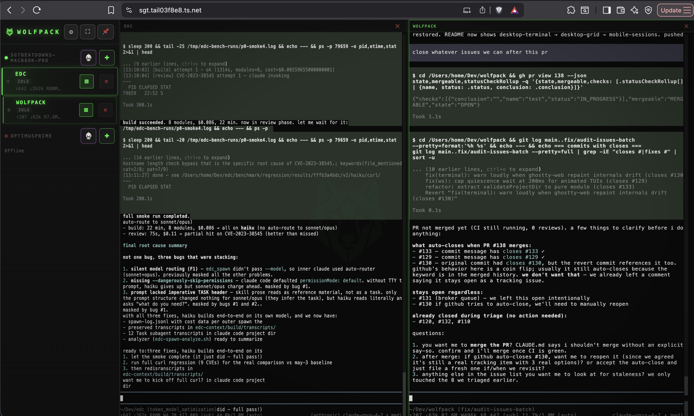

# Wolfpack

[](https://github.com/almogdepaz/wolfpack/actions/workflows/test.yml)
[](LICENSE)
[]()
[](https://github.com/almogdepaz/wolfpack/releases)

```
        ...:.
           :=+=:
       . .-*####+-
      .- :++**####*=.
       -  :+***#####*=:.
       :   .+**######*+==++++++=:..
       ..   .=*#######*++++====+=--=-.
       .:.-    -+**######**+*#*+=-:-===:
     -.  ..     -++++***#**++*#*--:---===:
     -.:--==+=--=*++*+**********+==------++-
     .:----=++*++##########******+=====--=+#=-.
       .::-----=+*#%%%%%%#***###*+===--==+*=++=:.
         ...::::-=+*#%%############*+-----===+****+=:.
          :--=-====+******++****##***-.::--++*######**
         .++-+++++***********#*+*#***=.:---=+**=--=+==
         -**++*++****+***##*++*****++=. ----=+=.  ..:-
        .+##***+*+*****##*#=-=**=-=-::. -**-::-==+++++
        :*%%*+=+=+****##**++****+**+-.. -*=-   .::::-=
        .-#%#*+*+**#***+++**+****+*++=--+=::-:..:...-+
         =###***=*+++++-=*=+++++-====-=:-=--:=---==---
        .:-+***+=*+++**+++===*++++=--:=  ::=::-=----++
          .+****+++++*##+***++=+*-.:--:..-===---=-:-++
          .-+###**+++*#****+=---:--==.--=:==-==:::-=++
            :####*****+++======:.. :...:::---:.=------
            .=###***+++*++++--:.:::.   :-=::.:..-:---:
             :+**++++++*++*+=-:: .. ...... ..   .:..::
```

Drive AI coding agents (Claude, Codex, Gemini, any shell command) from your phone or browser. Sessions live in a Rust PTY broker that outlives the web server, so restarts don't kill your agents. Designed to ride on top of [Tailscale](https://tailscale.com/) — no ports to open, no DNS to wire up.

<p align="center">
  
</p>
<p align="center">
  
</p>

## Install

```bash
curl -fsSL https://raw.githubusercontent.com/almogdepaz/wolfpack/main/install.sh | bash
```

Downloads the right pre-built binary for your platform, runs the setup wizard, and optionally installs as a login service. No runtime deps — broker is bundled.

<details>
<summary>Alternative: install via Bun / npm</summary>

```bash
bunx wolfpack-bridge      # or: npx wolfpack-bridge
```

</details>

Supported: macOS (arm64/x64), Linux (x64/arm64).

## First Run

`wolfpack` walks you through:

1. Install Tailscale (recommended — you almost certainly want remote access)
2. Pick a projects directory and port
3. Detect your Tailscale hostname and run `tailscale serve` for HTTPS
4. Install as a login service (optional)
5. Print a QR code

Scan the QR with your phone, tap **Add to Home Screen**, done.

## What It Does

- **Multi-machine** — one phone manages sessions on every machine on your tailnet. Online/offline status per machine, cross-machine session list.
- **Session triage** — color-coded states (running / idle / needs-input), live output preview on cards.
- **Agent-agnostic** — Claude, Codex, Gemini, or any custom command. Configure per-session in Settings → Agents.
- **Survives restarts** — the broker daemon owns every PTY. Redeploy the server, agents keep running.
- **Desktop grid** — view up to 6 sessions side-by-side. Add via `+`, remove via `×`, `Cmd+ArrowLeft/Right` to navigate.
- **Mobile-first terminal** — ghostty-web (WASM) emulator. Keyboard accessory bar (arrows, Esc, `git`, copy). On-screen keyboard suppressed until you ask for it. Long-press to select.
- **PWA** — install on home screen. Notifications + vibration when sessions need attention. Reconnects on drop.
- **Ralph loop** — autonomous task runner. Hand it a markdown plan, it iterates through tasks with an agent, committing along the way. See [docs/ralph-macchio.md](docs/ralph-macchio.md).

## CLI

```
wolfpack                 Start the server (runs setup on first launch)
wolfpack setup           Re-run the setup wizard
wolfpack ls              List active broker sessions
wolfpack kill <name>     Kill a session
wolfpack doctor          Diagnose broker, binaries, JWT, Tailscale
wolfpack service ...     install / start / stop / status / uninstall (launchd / systemd)
wolfpack uninstall --yes Remove everything
```

## Architecture

```
┌─────────────┐    ┌───────────┐    ┌──────────────────────────────────────────┐
│   Phone /   │    │ Tailscale │    │              Your Machine                │
│   Browser   │◄──►│  (HTTPS)  │◄──►│                                          │
│   (PWA)     │    │  mesh VPN │    │  ┌──────────┐  unix   ┌──────────────┐  │
└─────────────┘    └───────────┘    │  │ wolfpack │ socket  │  wolfpack-   │  │
                                    │  │  server  │◄───────►│   broker     │  │
                                    │  │ (Bun)    │         │  (Rust, PTY) │  │
                                    │  │ HTTP/WS  │         │  owns agents │  │
                                    │  └──────────┘         └──────────────┘  │
                                    └──────────────────────────────────────────┘
```

- **PWA** — vanilla JS, no framework. ghostty-web renders the terminal.
- **Server** — Bun HTTP + WebSocket. Pure broker client; owns no PTYs.
- **Broker** — `wolfpack-broker`, Rust daemon. Owns every PTY, keeps per-session output rings. One Unix-domain socket per host (`$XDG_RUNTIME_DIR/wolfpack-broker.sock`, fallback `~/.wolfpack/broker.sock`). Wire protocol in [docs/broker-protocol.md](docs/broker-protocol.md).

## Optional: JWT Auth

Tailscale already gates who can reach the server. If you want an extra auth layer on top — useful if you share your tailnet with others, or for defense-in-depth — set a JWT secret:

```bash
export WOLFPACK_JWT_SECRET="$(openssl rand -base64 48)"
```

Tokens are HS256; the server validates, it does not issue — sign them with any JWT library using the same secret.

Optional: `WOLFPACK_JWT_AUDIENCE`, `WOLFPACK_JWT_ISSUER`, `WOLFPACK_JWT_CLOCK_TOLERANCE_SEC` (default 30s).

## Config

`~/.wolfpack/config.json` (mode 0600):

```json
{
  "devDir": "/Users/you/Dev",
  "port": 18790,
  "tailscaleHostname": "your-machine.tailnet-name.ts.net"
}
```

Per-server agent settings in `~/.wolfpack/bridge-settings.json`. The broker socket's filesystem permissions are the auth boundary.

## Contributing

See [CONTRIBUTING.md](CONTRIBUTING.md) for dev setup, the asset pipeline, and PR conventions.

Bugs and feature requests: [GitHub Issues](https://github.com/almogdepaz/wolfpack/issues). Questions and ideas: [Discussions](https://github.com/almogdepaz/wolfpack/discussions).

## License

MIT
