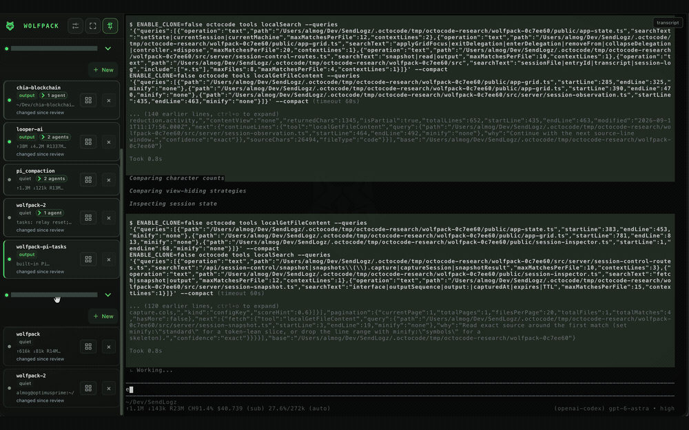
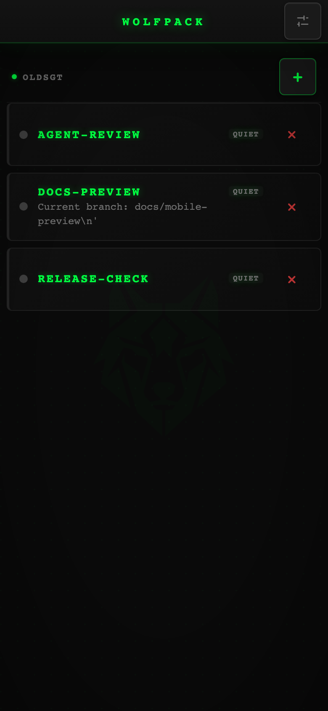
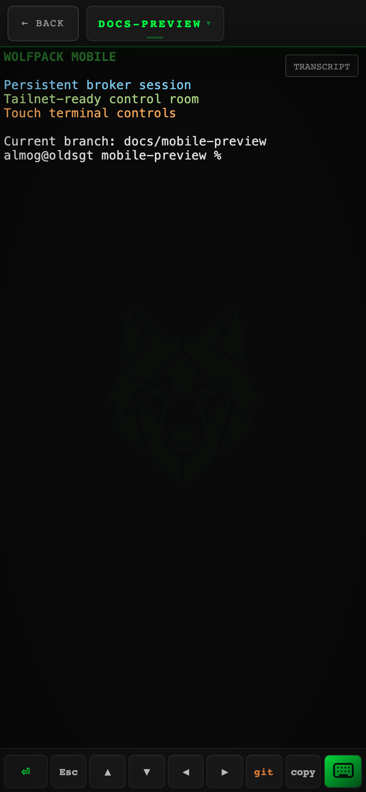
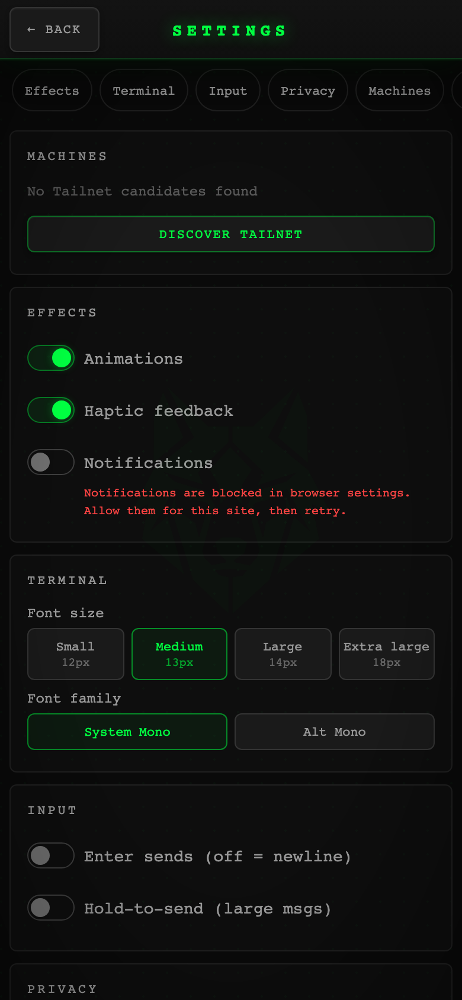

# Wolfpack — browser terminal manager for AI coding agents

[](https://github.com/almogdepaz/wolfpack/actions/workflows/test.yml)
[](LICENSE)
[]()
[](https://get-wolfpack.netlify.app/)

Run Claude Code, Codex, Gemini, and shell sessions on machines you control. Reach them locally in a browser, or remotely from a browser or phone over Tailscale, without a Wolfpack-hosted relay or account.

Sessions live in a Rust PTY broker, not the web server, so server restarts and upgrades do not kill your agents.

**Homepage:** [get-wolfpack.netlify.app](https://get-wolfpack.netlify.app/) · **Agent-readable overview:** [llms.txt](https://get-wolfpack.netlify.app/llms.txt)

<p align="center">
  
</p>

<p align="center">
  
  
  
</p>

> **security:** wolfpack gives browser users shell-level control over configured projects. Keep it private to a trusted Tailnet. If other people share the Tailnet, configure device/user ACLs and consider JWT. Session control follows the ordinary global API auth policy when configured and has no inter-session authorization layer; read the [full trust model](docs/installation.md#security-and-trust).

## quickstart

### curl installer: persistent CLI

```bash
curl -fsSL https://raw.githubusercontent.com/almogdepaz/wolfpack/main/install.sh | bash
wolfpack
```

A bare `wolfpack` runs setup on first launch. Later, it ensures the managed server is current/running and prints local and verified remote URLs plus a QR code.

### Bunx or npm: package runner

```bash
bunx wolfpack-bridge@latest
# or
npx --yes wolfpack-bridge@latest
```

Package runners use the same setup wizard but do not add `wolfpack` to `PATH`. Use the runner prefix for every later command.

## first success

**you’ll choose:** a projects directory, port, Tailscale remote access, optional Pi integration, and whether Wolfpack starts at login.

**success looks like:** a local URL; a verified Tailnet HTTPS URL and QR code when remote access is configured; and a diagnosis command with no unresolved failures.

| install path | verify |
| --- | --- |
| curl | `wolfpack doctor` |
| Bunx | `bunx wolfpack-bridge@latest doctor` |
| npm/npx | `npx --yes wolfpack-bridge@latest doctor` |

Open the local URL on the host machine. The project picker lists projects under the configured directory by default; **Open existing directory** can launch an existing server-local absolute path elsewhere. For phone or remote access, scan only the verified Tailnet HTTPS QR code.

To uninstall: `wolfpack uninstall --yes` (curl), `bunx wolfpack-bridge@latest uninstall --yes` (Bunx), or `npx --yes wolfpack-bridge@latest uninstall --yes` (npm).

## why wolfpack

| instead of | Wolfpack gives you |
| --- | --- |
| SSH and tmux juggling | browser and phone control for agent terminals |
| sessions dying on server restart | broker-owned persistent PTYs |
| hosted remote-control SaaS | direct private Tailnet access, without a Wolfpack relay or account |
| one host at a time | trusted multi-machine session control |

- **see what needs attention** — running, idle, and needs-input session states with live output previews.
- **work how you prefer** — phone PWA, desktop terminal grid, notifications, and direct terminal attach.
- **use the agents you already run** — built-in commands or custom commands on `PATH`; configure them in **Settings → Agents**.

The multi-machine dashboard and desktop sidebar show only local sessions and currently ready, handshake-verified Wolfpack peers. Generic, offline, malformed, and unreachable Tailnet candidates stay out of the control room; **Settings → Machines** retains bounded discovery diagnostics. Peer headers show the machine display name and hostname without rendering internal node, installation, or routing identities.

## docs

- [installation and first success](docs/installation.md) — install methods, service behavior, platform detail, verification, and uninstall.
- [troubleshooting](docs/troubleshooting.md) — recover from setup, service, broker, and remote-access failures.
- [terminal attach](docs/cli-attach.md) — attach a local terminal with `wolfpack attach [name]`.
- [session control](docs/session-control.md) — scriptable session-control API.
- [multi-machine control room](docs/multi-machine-control-room.md) — peer readiness, visibility, diagnostics, and identity privacy.
- [agent skills](docs/agent-skills.md) — install the Wolfpack control skill for supported agent harnesses.
- [task gateway](docs/task-gateway.md) — durable Pi Task routing, retention, and federation limits.
- [broker protocol](docs/broker-protocol.md) — broker wire protocol and terminal-state boundary.

## agent skills

`wolfpack-tailnet-control` works with all agent harnesses that support Agent Skills. The opt-in Pi flow in `wolfpack setup` copies the bundled control skill, then installs Pi Tasks with `pi install npm:@sgtbeatdown/pi-tasks`. `wolfpack-tailnet-control` controls sessions; `wolfpack-pi-task-delegation` teaches Pi to use `agent_task_*` for durable task routing.

For a manual audited install, clone or update `https://github.com/almogdepaz/wolfpack`, review `skills/wolfpack-tailnet-control/SKILL.md`, then place the skill in `~/.pi/agent/skills/`, `~/.agents/skills/`, or `~/.claude/skills/`. Start a fresh agent context afterward. Platform binaries do not expose skills as files; detailed safe symlink and copy instructions are in [agent skills](docs/agent-skills.md).

## advanced automation

Target the supported session-control surface on a configured Tailnet peer with the global selector:

```bash
wolfpack --machine <short-name-or-fqdn> list --json
wolfpack --machine <short-name-or-fqdn> session status <session-or-id> --json
```

Short names use the exact suffix from configured `tailscaleHostname`; full names must be canonical hostnames in that same suffix. Wolfpack sends the normal JWT authorization on a bounded `GET /api/machine` handshake and subsequent requests. Invalid, incompatible, redirected, timed-out, or unreachable targets fail closed without localhost fallback. Remote JSON successes add verified `"machine"` identity while retaining server-owned `sessionId` values. `agent spawn` still resolves its parent on the selected machine and does not invent cross-machine lineage.

Create a top-level project session with an initial instruction:

```bash
wolfpack session create project-name --harness pi --plan .plans/000-task.md --json
```

Spawn a same-harness child agent:

```bash
wolfpack agent spawn project-name --plan .plans/000-review.md --notify-parent --json
```

To select an existing directory outside the configured projects root, replace the project name with `--project-dir <path>` on either command. Relative CLI paths are resolved locally; the server accepts and canonicalizes only existing absolute directories.

Use `wolfpack session create <project>` for top-level work and `wolfpack agent spawn <project>` for a same-harness child. The server validates the project selector and command, allocates a stable broker session ID, and delivers the initial instruction directly to the harness. For the full command surface and automation contract, use [session control](docs/session-control.md) and [task gateway](docs/task-gateway.md).

## contributing

See [CONTRIBUTING.md](CONTRIBUTING.md) for development setup, the asset pipeline, and PR conventions.

Bugs and feature requests: [GitHub Issues](https://github.com/almogdepaz/wolfpack/issues). Questions and ideas: [Discussions](https://github.com/almogdepaz/wolfpack/discussions).

## license

MIT
