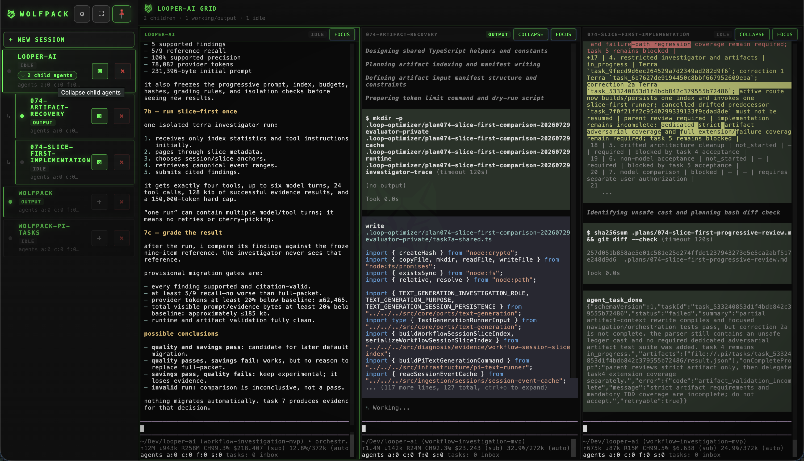
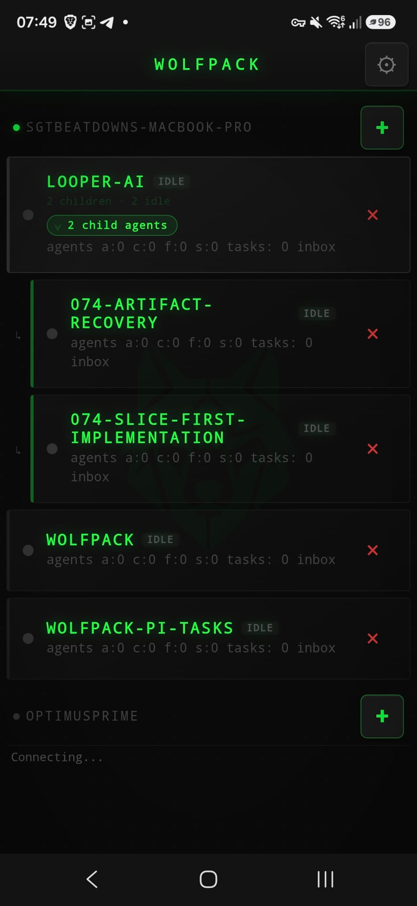
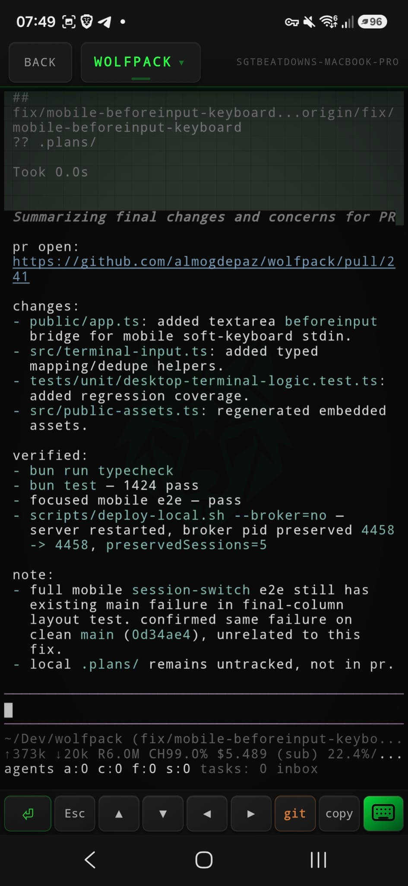

# Wolfpack — browser terminal manager for AI coding agents

[](https://github.com/almogdepaz/wolfpack/actions/workflows/test.yml)
[](LICENSE)
[]()
[](https://github.com/almogdepaz/wolfpack/releases)

Wolfpack is a self-hosted browser terminal dashboard for AI coding agents: Claude Code, Codex, Gemini, shell commands, and custom agent wrappers.
It runs on your own macOS/Linux machine — laptop, workstation, or cloud VM — and gives you a PWA command center for long-running agent terminal sessions across your Tailscale tailnet.

Sessions live in a Rust PTY broker, not the web server, so server restarts and redeploys do not kill your agents.
There is no Wolfpack-hosted relay or account; remote access is normally handled by [Tailscale](https://tailscale.com/).

<p align="center">
  
</p>
<p align="center">
  
  
</p>
<p align="center">
  
</p>
<p align="center">
  <a href="docs/assets/wolfpack-usage-demo.mp4">Watch/download the MP4 demo</a>
</p>

## Quickstart

```bash
curl -fsSL https://raw.githubusercontent.com/almogdepaz/wolfpack/main/install.sh | bash
wolfpack
```

The installer downloads the right pre-built binaries for your platform, runs setup, and can install Wolfpack as a login service. Wolfpack's phone and remote-control workflow uses Tailscale; setup can install it, waits for sign-in, then verifies its private HTTPS route before it prints a phone QR code. The bundled `wolfpack-broker` includes its Ghostty VT engine; release installs do not need Zig, Ghostty, or extra system libraries.
Supported: macOS arm64/x64 and Linux x64/arm64.

Want a package runner instead? Pin `@latest` so Bun/npm does not reuse an older cached release:

```bash
bunx wolfpack-bridge@latest
# or
npx --yes wolfpack-bridge@latest
```

Both package-runner commands resolve the same matching prebuilt `wolfpack` and `wolfpack-broker` pair as the curl installer, then run the same setup wizard. Unlike curl, they do not add `wolfpack` to your shell `PATH`; use curl when you want a persistent CLI installation.

If setup gets weird, run:

```bash
wolfpack doctor
```

Uninstall is explicit:

```bash
wolfpack uninstall --yes
```

## First five minutes

1. Run the installer.
2. Choose your projects directory and port. On a fresh install, setup enables `shell` plus supported providers detected on `PATH`; existing agent settings are never overwritten.
3. Sign in to Tailscale when setup opens it (macOS) or prompts for `sudo tailscale up` (Linux). Setup keeps the same run open for retry.
4. Setup configures and verifies `tailscale serve` before it prints the private Tailnet HTTPS QR code.
5. Install the service when prompted if you want Wolfpack and its agents reachable after login/reboots.
6. Scan the QR code, open Wolfpack on your phone, then **Add to Home Screen**.
7. Create a session and pick an agent command.

A local browser can still open Wolfpack on the host machine. It is not phone access: only a verified Tailnet HTTPS QR code opens Wolfpack from another device.

## Why use it

Use Wolfpack when you want a self-hosted alternative to juggling tmux panes, SSH windows, and cloud workspaces for AI agent sessions.
It is an AI agent terminal orchestrator for developers who need persistent browser/mobile access to coding agents running on machines they control.

- **Phone-first agent control** — respond to Claude/Codex/Gemini while away from your desk.
- **Multi-machine view** — manage sessions from every machine in your tailnet, including cloud VMs.
- **Persistent PTYs** — the Rust broker owns sessions, so server restarts do not kill agents.
- **Session triage** — cards show running/idle/needs-input state and live output previews.
- **Desktop grid** — view up to 6 terminals side by side.
- **PWA UX** — install on your home screen, reconnect on drops, receive notifications when sessions need attention.
- **Agent-agnostic** — use built-in commands or add your own shell command in Settings → Agents.
- **Provider readiness** — First-run setup enables detected supported CLIs; Settings → Agents shows path/version and login guidance and lets you add providers installed later.

## Agent recipes

Wolfpack starts sessions by running a command in the selected project directory.
Configure commands in **Settings → Agents**.

| Agent | Command |
| --- | --- |
| Shell | `shell` |
| Claude Code | `claude` |
| Codex | `codex` |
| Gemini | `gemini` |
| Cursor | `cursor` |
| Pi | `pi` |
| Custom wrapper | any command on `PATH`, for example `opencode` or `my-agent --flag` |

`cmd` validation intentionally rejects shell metacharacters for session commands. If you need complex setup, put it in a wrapper script on `PATH` and add that command.

## CLI

```text
wolfpack                 Start the server (runs setup on first launch)
wolfpack setup           Re-run the setup wizard
wolfpack list [--json]   List active broker sessions
wolfpack session create  Create a top-level project session
wolfpack agent spawn     Spawn a same-harness child agent
wolfpack session ...     Status/read/send/wait/prompt helpers for agent automation
wolfpack attach [name]   Attach the local terminal to an existing session
wolfpack kill <name|id>  Kill a session
wolfpack --version       Print the installed version
wolfpack doctor          Diagnose broker, binaries, JWT, Tailscale
wolfpack service ...     install / start / stop / restart / status / uninstall (add --broker to include broker)
wolfpack uninstall --yes Remove everything
```

Create a top-level project session with its initial instruction delivered at launch:

```bash
wolfpack session create branchout --harness pi --plan .plans/000-task.md --json
```

Spawn a same-harness child from an existing Wolfpack agent:

```bash
wolfpack agent spawn wolfpack --plan .plans/000-review.md --notify-parent --json
```

Each command makes one server-owned request and returns the stable broker `sessionId`. The server validates the project, allocates the name, persists identity, and passes startup instructions directly to the harness instead of racing terminal readiness. `--plan` generates a compact plan handoff without copying plan contents; `--prompt-file` avoids shell heredoc/quoting failures for bespoke long prompts. Child spawning derives the parent harness and structured hierarchy without inheriting its transcript or context. `wolfpack session open` remains a deprecated child-spawn alias.

Direct terminal attach: [docs/cli-attach.md](docs/cli-attach.md). Scriptable session control: [docs/session-control.md](docs/session-control.md).

Troubleshooting: [docs/troubleshooting.md](docs/troubleshooting.md).

## Trust and security model

Wolfpack is self-hosted software for machines you control. Those machines can be local laptops, workstations, or cloud VMs.

- Browser/PWA talks to the Wolfpack server over HTTP/WebSocket.
- Remote access is normally private HTTPS through Tailscale.
- The server talks to the broker over a per-user Unix socket.
- The broker owns the PTYs and runs your selected commands locally on that machine.
- Optional JWT auth can be layered on top of Tailscale.
- Session control follows the ordinary global API auth policy when configured and adds no inter-session authorization layer. Tailnet/global Wolfpack access remains the trust boundary; sessions can list and communicate with other sessions.
- Wolfpack does not provide a hosted relay, managed account, or prompt upload service.

Running coding agents is intentionally powerful: those commands execute with your local user permissions in the chosen project directory.
Treat Wolfpack access like shell access to that machine.

## Architecture

```text
┌─────────────┐    ┌───────────┐    ┌──────────────────────────────────────────┐
│   Phone /   │    │ Tailscale │    │       Your machine / cloud VM            │
│   Browser   │◄──►│  (HTTPS)  │◄──►│                                          │
│   (PWA)     │    │  mesh VPN │    │  ┌──────────┐  unix   ┌──────────────┐  │
└─────────────┘    └───────────┘    │  │ wolfpack │ socket  │  wolfpack-   │  │
                                    │  │  server  │◄───────►│   broker     │  │
                                    │  │ (Bun)    │         │  (Rust, PTY) │  │
                                    │  │ HTTP/WS  │         │  owns agents │  │
                                    │  └──────────┘         └──────────────┘  │
                                    └──────────────────────────────────────────┘
```

- **PWA** — vanilla JS, no framework. ghostty-web renders the terminal.
- **Server** — Bun HTTP + WebSocket. Pure broker client; owns no PTYs.
- **Broker** — `wolfpack-broker`, Rust daemon. Owns every PTY, keeps per-session output rings, and uses a statically linked Ghostty VT engine for authoritative terminal state/snapshots. One Unix-domain socket per host (`$XDG_RUNTIME_DIR/wolfpack-broker.sock`, fallback `~/.wolfpack/broker.sock`). Wire protocol in [docs/broker-protocol.md](docs/broker-protocol.md).

## Optional JWT auth

Tailscale already gates who can reach the server. If you want an extra auth layer on top — useful if you share your tailnet with others, or for defense-in-depth — set a JWT secret:

```bash
export WOLFPACK_JWT_SECRET="$(openssl rand -base64 48)"
```

Tokens are HS256; the server validates, it does not issue — sign them with any JWT library using the same secret.

Optional: `WOLFPACK_JWT_AUDIENCE`, `WOLFPACK_JWT_ISSUER`, `WOLFPACK_JWT_CLOCK_TOLERANCE_SEC` (default 30s).

## Config

`~/.wolfpack/config.json` (mode 0600):

```json
{
  "devDir": "/Users/you/Dev",
  "port": 18790,
  "tailscaleHostname": "your-machine.tailnet-name.ts.net"
}
```

Per-server agent settings live in `~/.wolfpack/bridge-settings.json`.

## Agent skills

Wolfpack exposes one repository-local agent skill in `skills/`:

- `wolfpack-tailnet-control` — discover, inspect, and control Wolfpack terminal sessions across Tailscale hosts.

### Pi subagent integration

When setup detects `pi` on `PATH`, it offers one default-no, opt-in installation.
Accepting uses Pi's package manager to install the complete integration:

```bash
pi install npm:wolfpack-bridge
pi install npm:@sgtbeatdown/pi-tasks
```

The pieces have separate jobs:

| Owner | Resource | Responsibility |
| --- | --- | --- |
| Wolfpack | `wolfpack-tailnet-control` | Creates, selects, inspects, and closes visible Wolfpack sessions. |
| Pi Tasks extension | `agent_task_*` | Sends assignments and records durable structured status/results; it does not create sessions. |
| Pi Tasks skill | `wolfpack-pi-task-delegation` | Teaches Pi to combine Wolfpack session control with the task tools and completion protocol. |

The first package exposes Wolfpack's bundled skills to Pi. The second package
contains both the Pi Tasks extension and its matching delegation skill. Every
participating Pi session needs Pi Tasks loaded; its default filesystem store
also requires parent and child sessions to use the same project directory.
Declining the setup prompt changes nothing. Non-interactive setup never installs
Pi packages and prints the commands instead.

Skills and extensions can execute commands with your user permissions. Review
the packages before accepting. Start a fresh Pi session afterward, or run
`/reload` in an existing session.

### Manual skill installation

Skills are executable agent instructions, so install only the ones you have audited. Clone or update `https://github.com/almogdepaz/wolfpack`, review the requested file (for example `skills/wolfpack-tailnet-control/SKILL.md`), then symlink that skill directory into one supported root:

- Pi global: `~/.pi/agent/skills/`
- shared Agent Skills root supported by Pi: `~/.agents/skills/`
- Claude global where used: `~/.claude/skills/`

Prefer symlinks so a reviewed `git pull --ff-only` updates the source. Refuse installation when the destination already exists; copying is also supported but must be refreshed manually. Start a fresh agent context afterward so skill descriptions are rescanned. Full fail-safe commands: [docs/agent-skills.md](docs/agent-skills.md).

For a top-level session or a same-harness child, invoke:

```bash
wolfpack session create <project> --harness pi --plan .plans/000-task.md --json
wolfpack agent spawn <project> --plan .plans/000-task.md --notify-parent --json
```

Platform binaries do not contain skills. The setup wizard only asks Pi's package manager to install them after explicit opt-in; the cloned repository remains the auditable source for manual installation.

## Contributing

See [CONTRIBUTING.md](CONTRIBUTING.md) for dev setup, the asset pipeline, and PR conventions.

Bugs and feature requests: [GitHub Issues](https://github.com/almogdepaz/wolfpack/issues). Questions and ideas: [Discussions](https://github.com/almogdepaz/wolfpack/discussions).

## License

MIT
