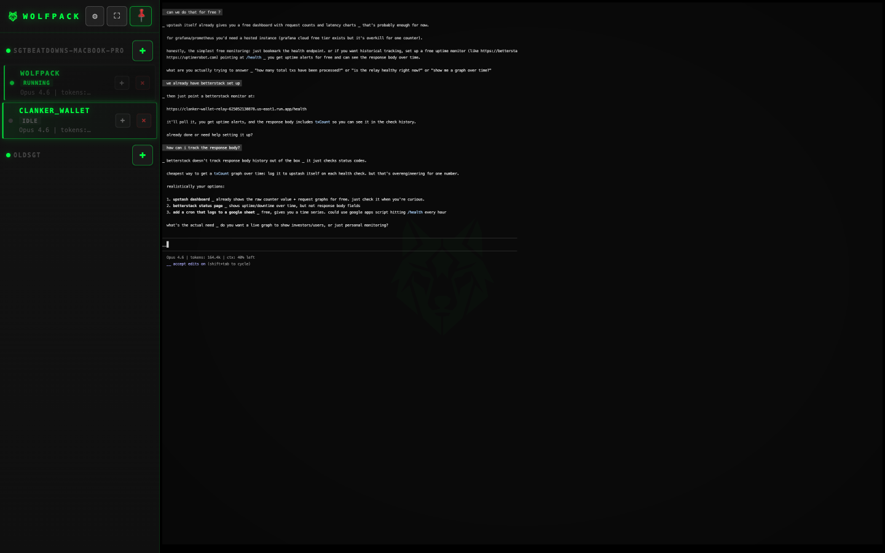
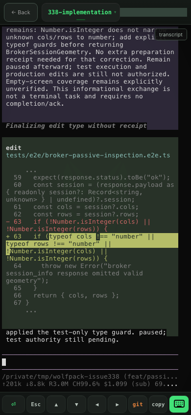

# Wolfpack

[](https://github.com/almogdepaz/wolfpack/actions/workflows/test.yml)
[](LICENSE)
[]()
[](https://github.com/almogdepaz/wolfpack/releases)
[](https://github.com/almogdepaz/wolfpack/stargazers)

```
        ...:.
           :=+=:
       . .-*####+-
      .- :++**####*=.
       -  :+***#####*=:.
       :   .+**######*+==++++++=:..
       ..   .=*#######*++++====+=--=-.
       .:.-    -+**######**+*#*+=-:-===:
     -.  ..     -++++***#**++*#*--:---===:
     -.:--==+=--=*++*+**********+==------++-
     .:----=++*++##########******+=====--=+#=-.
       .::-----=+*#%%%%%%#***###*+===--==+*=++=:.
         ...::::-=+*#%%############*+-----===+****+=:.
          :--=-====+******++****##***-.::--++*######**
         .++-+++++***********#*+*#***=.:---=+**=--=+==
         -**++*++****+***##*++*****++=. ----=+=.  ..:-
        .+##***+*+*****##*#=-=**=-=-::. -**-::-==+++++
        :*%%*+=+=+****##**++****+**+-.. -*=-   .::::-=
        .-#%#*+*+**#***+++**+****+*++=--+=::-:..:...-+
         =###***=*+++++-=*=+++++-====-=:-=--:=---==---
        .:-+***+=*+++**+++===*++++=--:=  ::=::-=----++
          .+****+++++*##+***++=+*-.:--:..-===---=-:-++
          .-+###**+++*#****+=---:--==.--=:==-==:::-=++
            :####*****+++======:.. :...:::---:.=------
            .=###***+++*++++--:.:::.   :-=::.:..-:---:
             :+**++++++*++*+=-:: .. ...... ..   .:..::
```

Mobile & desktop command center for AI coding agents. Control agent sessions (Claude, Codex, Gemini, or any custom command) across multiple machines from your phone or browser. Two session backends: **pty** (lightweight, no dependencies) or **tmux** (persistent, survives restarts). Secured by [Tailscale](https://tailscale.com/) — zero-config encrypted access, no ports to open.

Install on your phone's home screen for a native app experience — scan the QR code after setup and tap **"Add to Home Screen"**.

### Desktop
<p align="center">
  
</p>
<p align="center">
  
</p>

### Mobile

<p align="center">
  
</p>
<p align="center">
  <kbd>Classic</kbd>&nbsp;&nbsp;&nbsp;&nbsp;&nbsp;&nbsp;&nbsp;&nbsp;&nbsp;&nbsp;&nbsp;&nbsp;&nbsp;&nbsp;&nbsp;&nbsp;&nbsp;&nbsp;&nbsp;&nbsp;&nbsp;&nbsp;&nbsp;&nbsp;&nbsp;&nbsp;&nbsp;&nbsp;&nbsp;&nbsp;&nbsp;&nbsp;&nbsp;&nbsp;&nbsp;&nbsp;&nbsp;&nbsp;&nbsp;&nbsp;&nbsp;&nbsp;&nbsp;&nbsp;&nbsp;&nbsp;&nbsp;&nbsp;&nbsp;&nbsp;&nbsp;&nbsp;&nbsp;<kbd>Ghostty (WASM)</kbd>
</p>
<p align="center">
  
  
</p>

## Architecture

```
┌─────────────┐      ┌───────────┐      ┌──────────────────────────────────┐
│   Phone /   │      │ Tailscale │      │          Your Machine            │
│   Browser   │◄────►│  (HTTPS)  │◄────►│                                  │
│   (PWA)     │      │  mesh VPN │      │  ┌──────────┐ ┌──────┐ ┌─────┐  │
└─────────────┘      └───────────┘      │  │ wolfpack │ │pty or│ │Agent│  │
                                        │  │  server  │◄│ tmux │◄│(any)│  │
                                        │  │ HTTP/WS  │ │      │ │     │  │
                                        │  └──────────┘ └──────┘ └─────┘  │
                                        └──────────────────────────────────┘
```

**Components:**
- **PWA** — single-file vanilla JS app (~90KB), no framework. Mobile-optimized touch UI + desktop ANSI terminal
- **Server** — Bun HTTP + WebSocket. Serves embedded assets, manages sessions via pty (default) or tmux backend
- **Ralph** — detached subprocess that iterates through a markdown plan file, invoking agents per-task
- **Agents** — Claude, Codex, Gemini, or any shell command. Agent-agnostic by design

## Quick Install

```bash
bunx wolfpack-bridge
```

Or with npx:

```bash
npx wolfpack-bridge
```

Or via shell script (no Node/Bun required):

```bash
curl -fsSL https://raw.githubusercontent.com/almogdepaz/wolfpack/main/install.sh | bash
```

This will download the pre-built binary for your platform, run the setup wizard, and optionally install as a login service.

Supported platforms: macOS (Apple Silicon, Intel), Linux (x64, arm64).

### Prerequisites

- **Tailscale** *(optional)* — install from [tailscale.com/download](https://tailscale.com/download), sign in, and make sure both your computer and phone are on the same tailnet. Required for remote access.
- **tmux** *(optional)* — only needed if you choose the tmux backend. The default **pty** backend has no external dependencies.

### tmux History

Wolfpack can only hydrate history that tmux still retains. Desktop terminal sessions prefill the latest 5,000 lines on connect, so if you want deeper scrollback, raise tmux's history limit:

```tmux
set -g history-limit 50000
```

Reload tmux or restart your sessions after changing it.

## Usage

```bash
wolfpack                    # Start the server (runs setup on first launch)
wolfpack setup              # Re-run the setup wizard
wolfpack service install    # Auto-start on login (launchd / systemd)
wolfpack service stop       # Stop the background service
wolfpack service start      # Start the background service
wolfpack service status     # Check if running
wolfpack service uninstall  # Remove the launch agent
wolfpack uninstall          # Remove everything (service, config, global command)
```

### Setup Wizard

On first run, `wolfpack` walks you through:

1. Checking prerequisites (tmux, Tailscale — both optional)
2. Choosing a session backend (pty or tmux, default: pty)
3. Setting your projects directory (default: `~/Dev`)
4. Choosing a port (default: `18790`)
5. Enabling Tailscale HTTPS access
6. Optionally installing as a login service
7. Displaying a QR code to scan with your phone

## Features

### Session Management
- Create, view, and kill agent sessions (pty or tmux backend)
- Agent picker — Claude, Codex, Gemini, or custom commands per session
- Session triage — running, idle, and needs-input states with color-coded indicators
- Live terminal output preview on session cards

### Desktop
- **Multi-terminal grid** — view 2-6 sessions side-by-side in a CSS grid layout. Click `+` on any sidebar card to add it to the grid, `×` to remove. Focused cell highlighted with green glow.
- **Collapsible sidebar** — pin or auto-hide. Shows all sessions across machines with status badges, output preview, and grid/kill buttons.
- **xterm.js PTY** — full terminal emulator with direct PTY connection (not capture-pane polling)
- **Keyboard shortcuts:**
  - `Cmd/Ctrl + ArrowUp/Down` — cycle between sessions
  - `Cmd/Ctrl + ArrowLeft/Right` — navigate grid cells
  - `Cmd/Ctrl + T` — new session (project picker)
  - `Cmd/Ctrl + K` — clear terminal

### Mobile
- **Two terminal modes** — choose in Settings:
  - **Classic** (default) — lightweight capture-pane polling. No WASM, works on all devices. Best for quick monitoring and input.
  - **Ghostty (WASM)** — full terminal emulator via [ghostty-web](https://github.com/ghostty-org/ghostty). Richer output (colors, cursor, scrollback) but heavier on battery. Keyboard is suppressed by default — tap the keyboard button to open it.
- **Keyboard accessory** — quick-action bar with Enter, Esc, arrow keys, Ctrl combos, and git status
- **Touch scrolling** — momentum physics, long-press to select text and copy
- **Haptic feedback** — vibration on key actions (toggleable)
- **PWA** — install as a standalone app on your phone's home screen

All settings (terminal mode, font size, haptics, etc.) persist in localStorage across sessions.

### Multi-Machine
- One phone connects to multiple Wolfpack servers
- Sessions grouped by machine with online/offline status
- Auto-discover Tailscale peers running Wolfpack
- Cross-machine session management from a single UI

### Other
- **Notifications** — browser notifications + vibration when sessions need attention
- **Search** — find text in terminal output with match navigation
- **Reconnect handling** — auto-recovers on connection drop with status indicator
- **Auto-resize** — terminal resizes to match your screen/grid cell

### Remote Access

1. Install [Tailscale](https://tailscale.com/download) on both your computer and phone
2. Sign in to the same Tailscale account on both devices
3. Run `wolfpack setup` and say **y** to "Enable Tailscale HTTPS access?"
4. Scan the QR code with your phone
5. Tap **"Add to Home Screen"** for the native app experience

Tailscale's encrypted mesh network handles auth and routing — no ports to open, no DNS to configure.

### Security

**Always use the Tailscale hostname** (e.g. `https://mybox.tail1234.ts.net`) — not raw IPs. The QR code from setup already points to the correct URL. Raw IP access (LAN or Tailscale `100.x.x.x`) bypasses Tailscale's DNS-based routing and may not be protected by CORS.

**JWT authentication** adds a second layer of protection. Without it, anyone who can reach the server port has full access to your tmux sessions. To enable:

1. Generate a secret (minimum 32 characters):
   ```bash
   openssl rand -base64 48
   ```
2. Set the environment variable before starting wolfpack:
   ```bash
   export WOLFPACK_JWT_SECRET="your-secret-here"
   ```
   For service installs, add it to your shell profile or the service environment.

3. Optional configuration:
   - `WOLFPACK_JWT_AUDIENCE` — expected `aud` claim
   - `WOLFPACK_JWT_ISSUER` — expected `iss` claim
   - `WOLFPACK_JWT_CLOCK_TOLERANCE_SEC` — clock skew tolerance (default: 30s)

Tokens use HS256 (HMAC-SHA256). The server validates but does not issue tokens — generate them with any JWT library using the same secret.

**Without `WOLFPACK_JWT_SECRET` set, authentication is disabled.** This is fine for localhost-only usage but strongly recommended when the server is reachable over a network.

## Ralph Loop

Autonomous task runner. Write a markdown plan file, pick an agent, set iterations, and let it rip. Ralph reads the plan, extracts the first incomplete task, hands it to the agent, marks it done, and moves on — implementing, testing, and committing along the way. See [full documentation](docs/ralph-macchio.md).

## Config

Stored in `~/.wolfpack/config.json`:

```json
{
  "devDir": "/Users/you/Dev",
  "port": 18790,
  "backend": "pty",
  "tailscaleHostname": "your-machine.tailnet-name.ts.net"
}
```

Agent command and settings stored in `~/.wolfpack/bridge-settings.json`.

## Contributing

### Dev Setup

Requires [Bun](https://bun.sh/) (v1.2+).

```bash
git clone https://github.com/almogdepaz/wolfpack.git
cd wolfpack
bun install
bun run scripts/gen-assets.ts   # generate embedded assets (required once)
bun run cli.ts                  # start the server locally
```

### Testing

```bash
bun test                             # all tests
bun test tests/unit/                 # unit tests only
bun test tests/unit/plan-parsing.test.ts  # single file
```

Tests use Bun's built-in runner. Three categories:
- `tests/unit/` — plan parsing, ralph log parsing, escaping, validation, grid logic
- `tests/snapshot/` — launchd plist and systemd unit generation
- `tests/integration/` — API routes, ralph loop endpoints

### Asset Pipeline

Frontend files live in `public/`. The server doesn't serve from disk — everything is embedded:

1. Edit files in `public/` (HTML, PNG, manifest, etc.)
2. Run `bun run scripts/gen-assets.ts` — embeds them into `public-assets.ts` (binary→base64, text→string)
3. **Do NOT edit `public-assets.ts` manually** — it's auto-generated

### Building Binaries

```bash
bun run scripts/build.ts    # assets + 4 platform binaries in dist/
```

Compiles for: linux-x64, linux-arm64, darwin-x64, darwin-arm64.

### PR Conventions

- Branch off `main`
- Tests must pass (`bun test`)
- Keep PRs focused — one feature or fix per PR

## Community & Support

- 💬 [Open a Discussion](https://github.com/almogdepaz/wolfpack/discussions) — questions, ideas, show & tell
- 🐛 [File an Issue](https://github.com/almogdepaz/wolfpack/issues) — bugs and feature requests
- ⭐ **Star the repo** if Wolfpack saves you time — it helps others find it

## License

MIT
